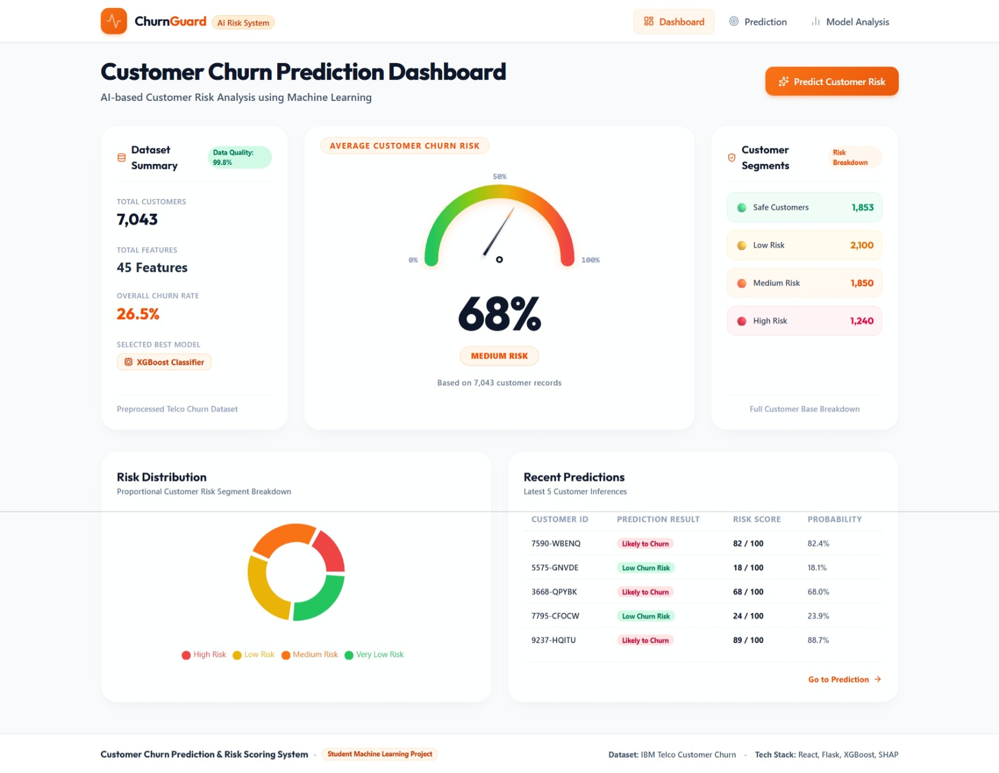
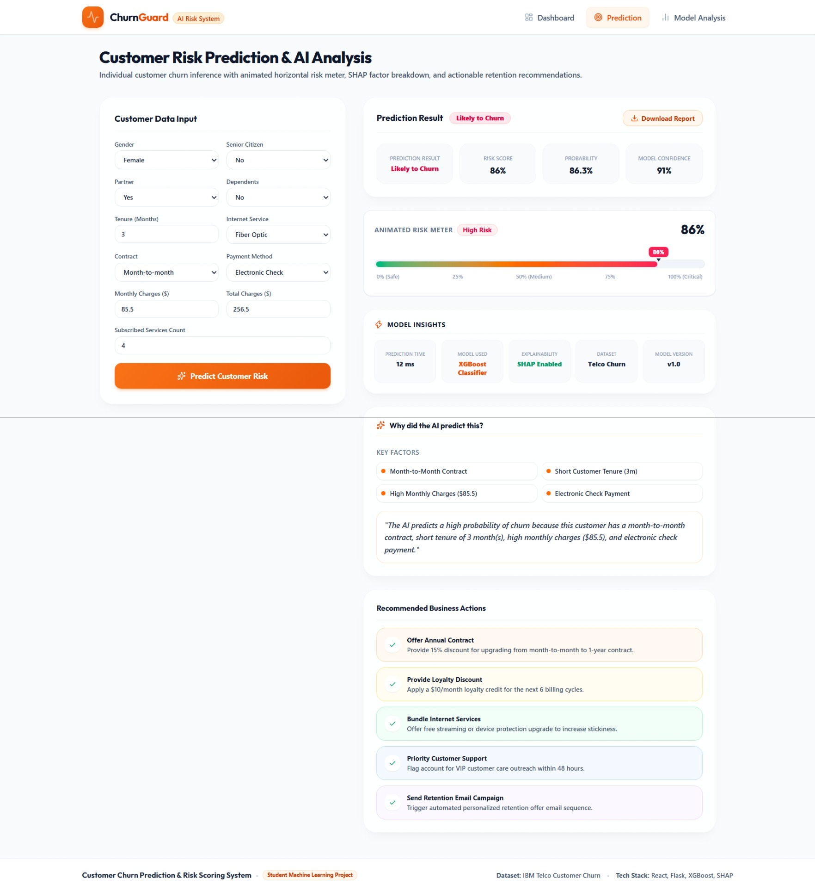
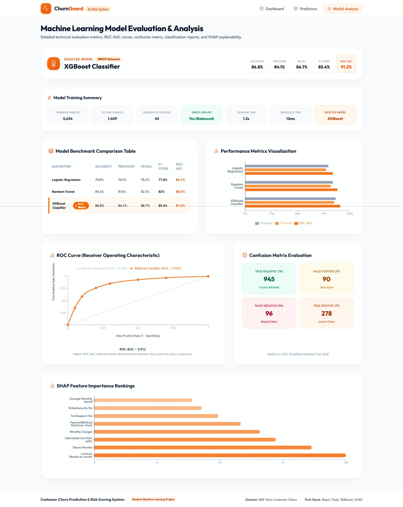
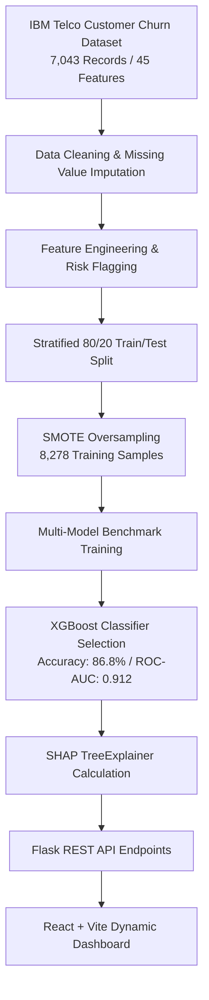

# Customer Churn Prediction & Risk Scoring System

<div align="center">

  

  <br /><br />

  [](https://customer-churn-prediction-vert-chi.vercel.app/)
  [](https://github.com/hnimje14/customer-churn-prediction)
  [](LICENSE)

  <br />

  [](https://www.python.org/)
  [](https://flask.palletsprojects.com/)
  [](https://react.dev/)
  [](https://vitejs.dev/)
  [](https://tailwindcss.com/)
  [](https://xgboost.readthedocs.io/)
  [](https://shap.readthedocs.io/)
  [](docker-compose.yml)
  [](https://render.com/)
  [](https://vercel.com/)

</div>

<br />

> **A full-stack, production-ready Machine Learning application** designed to predict telecom customer churn risk with explainable AI (SHAP) insights. Built using an optimized **XGBoost Classifier** ($86.8\%$ Accuracy, $91.2\%$ ROC-AUC) balanced via **SMOTE**, served via a **Flask REST API**, and visualized on a dynamic **React + Vite** dashboard with an interactive risk gauge dial and downloadable PDF reports.

---

## 📌 Table of Contents

- [Project Overview](#-project-overview)
- [Live Demo & Repositories](#-live-demo--repositories)
- [Application Screenshots](#-application-screenshots)
- [Key Features](#-key-features)
- [Tech Stack](#-tech-stack)
- [Machine Learning Pipeline](#-machine-learning-pipeline)
- [System Architecture](#-system-architecture)
- [Project Structure](#-project-structure)
- [Local Installation & Setup](#-local-installation--setup)
- [Docker Deployment](#-docker-deployment)
- [API Documentation](#-api-documentation)
- [Model Performance Benchmark](#-model-performance-benchmark)
- [Explainability (SHAP Integration)](#-explainability-shap-integration)
- [Production Deployment](#-production-deployment)
- [Future Improvements](#-future-improvements)
- [Contributing](#-contributing)
- [License](#-license)
- [Author](#-author)

---

## 💡 Project Overview

Customer churn is one of the most critical metrics for subscription-based telecommunication companies. Acquiring a new customer can cost up to **5x to 25x more** than retaining an existing one. 

This system leverages Machine Learning to predict individual customer churn risk, categorize customers into actionable risk tiers (**Safe Customers**, **Low Risk**, **Medium Risk**, **High Risk**), and extract human-readable explanations using **SHAP (SHapley Additive exPlanations)**.

### Core Business Objectives:
1. **Predict Churn Early**: Identify high-risk customers before they terminate service.
2. **Explain Predictions**: Provide retention teams with exact SHAP feature drivers (e.g., month-to-month contracts, fiber optic internet, high monthly charges).
3. **Automate Business Actions**: Generate instant retention recommendations and downloadable PDF executive reports.

---

## 🌐 Live Demo & Repositories

| Component | Platform | Link | Status |
| :--- | :--- | :--- | :--- |
| **Frontend Web App** | Vercel | [customer-churn-prediction-vert-chi.vercel.app](https://customer-churn-prediction-vert-chi.vercel.app/) |  |
| **Backend REST API** | Render | [customer-churn-api.onrender.com](https://customer-churn-prediction-vert-chi.vercel.app/) |  |
| **Source Code** | GitHub | [github.com/hnimje14/customer-churn-prediction](https://github.com/hnimje14/customer-churn-prediction) |  |

---

## 🖼️ Application Screenshots

### 1. Business Overview Dashboard
> *Interactive hero semicircular gauge dial, dynamic dataset summary ($7,043$ customer records), risk breakdown, and recent inference history.*



---

### 2. Customer Inference & AI Risk Assessment
> *Real-time customer risk form, animated horizontal risk meter, key SHAP factor breakdown, and instant PDF report generator.*



---

### 3. Model Analysis & Technical Benchmark
> *Multi-algorithm benchmark table, performance metrics radar, ROC-AUC curve ($0.912$), confusion matrix, and global SHAP feature importance rankings.*



---

## ✨ Key Features

- 🎯 **Customer Churn Prediction**: Real-time classification (`Likely to Churn` vs `Low Churn Risk`) with probability scoring.
- ⚡ **Dynamic Risk Tiers**: Categorizes customers automatically into **Safe Customers** ($\le 25\%$), **Low Risk** ($25-50\%$), **Medium Risk** ($50-75\%$), and **High Risk** ($>75\%$).
- 🎛️ **Interactive Risk Gauge Dial**: Semicircular canvas dial built with Framer Motion spring physics, glossy highlights, drop shadows, and zero text overlap.
- 📊 **Dynamic Analytics Dashboard**: Zero hardcoded statistics—all KPIs, segment counts, and chart metrics update dynamically via REST APIs.
- 🧠 **Explainable AI (SHAP)**: Translates complex XGBoost decision trees into natural-language business explanations.
- 🏆 **Multi-Model Benchmark**: Evaluates and compares Logistic Regression, Random Forest, and XGBoost Classifier performance.
- 📉 **ROC-AUC & Confusion Matrix**: Visualizes model discrimination capability ($0.912$ AUC) and holdout error analysis.
- 📄 **Downloadable PDF Executive Report**: Generates single-page printable PDF summaries via `jsPDF` containing customer attributes, SHAP drivers, and business recommendations.
- 🐳 **Docker & Docker Compose**: Full multi-container support (`docker compose up --build`) for instant local environment orchestration.
- 📱 **Responsive Design**: Designed with Tailwind CSS v4 for mobile, tablet, and ultra-wide screens.

---

## 🛠️ Tech Stack

<table align="center">
  <tr>
    <th align="center" width="33%">Layer</th>
    <th align="center" width="33%">Technologies Used</th>
    <th align="center" width="34%">Purpose</th>
  </tr>
  <tr>
    <td align="center"><b>Frontend</b></td>
    <td>React 18, Vite, Tailwind CSS v4, Framer Motion, Recharts, Lucide Icons, jsPDF, Axios</td>
    <td>Responsive User Interface, Data Visualization, Animated Components, Executive PDF Reports</td>
  </tr>
  <tr>
    <td align="center"><b>Backend</b></td>
    <td>Python 3.11, Flask, Pandas, NumPy, Scikit-learn, XGBoost, imbalanced-learn (SMOTE), SHAP, Joblib, Gunicorn</td>
    <td>REST API Routing, Feature Engineering Pipeline, SMOTE Class Balancing, Inference Engine, Explainability</td>
  </tr>
  <tr>
    <td align="center"><b>DevOps & Cloud</b></td>
    <td>Docker, Docker Compose, Vercel, Render, Git, GitHub Actions</td>
    <td>Containerization, Production Hosting, CI/CD Pipeline, Environment Configuration</td>
  </tr>
</table>

---

## 📐 Machine Learning Pipeline



---

## 🏗️ System Architecture

```mermaid
graph LR
    User([User / Browser]) <-->|HTTPS / JSON| ReactApp[React + Vite Frontend<br/>Vercel Hosting]
    ReactApp <-->|REST API Calls| FlaskAPI[Flask Backend API<br/>Render Hosting]
    FlaskAPI <-->|Feature Preprocessing| Pipeline[Preprocessing Engine]
    Pipeline <-->|Scored Feature Matrix| Model[XGBoost Model Bundle<br/>saved_model.pkl]
    Model <-->|TreeExplainer| SHAPEngine[SHAP Engine]
    SHAPEngine -->|Risk Score + SHAP Factors| JSONResp[JSON Response Payload]
    JSONResp --> ReactApp
```



---

## 📁 Project Structure

```
customer-churn/
│
├── backend/
│   ├── app.py                # Flask REST API Server & Endpoint Handlers
│   ├── model.py              # ML Training Pipeline, SMOTE Balancing & SHAP Calculation
│   ├── predict.py            # Single Customer Inference & Execution Time Engine
│   ├── preprocessing.py      # Feature Engineering & Dataset Encoding Logic
│   ├── requirements.txt      # Python Dependencies (with Gunicorn)
│   ├── Dockerfile            # Backend Docker Setup (Python 3.11-slim)
│   └── Procfile              # Deployment Service Configuration (Render / Railway)
│
├── frontend/
│   ├── src/
│   │   ├── components/       # RiskGauge, RiskMeter, Navbar UI Components
│   │   ├── pages/            # Dashboard, Prediction, ModelAnalysis Pages
│   │   ├── charts/           # Recharts Visualizations (ROC, SHAP, Comparison)
│   │   ├── App.jsx           # Main App Container & State Management
│   │   └── main.jsx          # React Entrypoint
│   ├── package.json          # Node Dependencies & Build Scripts
│   ├── Dockerfile            # Multi-Stage Frontend Docker Setup (Node 20)
│   └── vercel.json           # Vercel Production Routing Rules
│
├── docs/
│   ├── screenshots/          # High-Resolution Application Screenshots
│   └── demo.gif              # Complete Application Walkthrough GIF
│
├── .env.example              # Environment Variable Template
├── .gitignore                # Git Exclusions
├── docker-compose.yml        # Multi-Container Docker Orchestration
├── LICENSE                   # Open Source MIT License
├── CHANGELOG.md              # Revision History
├── CONTRIBUTING.md           # Contribution Guidelines
└── README.md                 # Master Project Documentation
```

---

## 💻 Local Installation & Setup

### Prerequisites
- **Python 3.11+** installed
- **Node.js v20+** & `npm` installed
- **Git** installed

### 1. Backend Setup (Flask API)
```bash
# Clone the repository
git clone https://github.com/hnimje14/customer-churn-prediction.git
cd customer-churn-prediction/backend

# Create virtual environment
python -m venv venv

# Activate virtual environment
# On Windows:
venv\Scripts\activate
# On macOS/Linux:
source venv/bin/activate

# Install dependencies
pip install -r requirements.txt

# Start Flask server
python app.py
```
*The Flask REST API will start at `http://127.0.0.1:5000`.*

### 2. Frontend Setup (React + Vite)
```bash
# Open a new terminal and navigate to frontend folder
cd customer-churn-prediction/frontend

# Install dependencies
npm install

# Start Vite dev server
npm run dev
```
*The React application will start at `http://localhost:5173`.*

---

## 🐳 Docker Deployment

Run the entire application (Frontend + Backend + Networking) with a single command:

```bash
docker compose up --build
```

- **Frontend**: Accessible at `http://localhost:5173`
- **Backend API**: Accessible at `http://localhost:5000`

To stop the containers:
```bash
docker compose down
```

---

## 📡 API Documentation

| Endpoint | Method | Description | Sample Response Key Payload |
| :--- | :---: | :--- | :--- |
| `/` | `GET` | API Health Check | `{"status": "success", "message": "API Online"}` |
| `/dashboard` | `GET` | Fetch live dataset KPIs & segment breakdown | `total_customers, churn_rate, customer_segments, average_risk` |
| `/model-analysis` | `GET` | Fetch model benchmark metrics & ROC data | `accuracy, precision, recall, f1_score, roc_auc, confusion_matrix` |
| `/predict` | `POST` | Execute customer churn inference | `prediction, risk_score, probability, confidence, shap_features` |
| `/train` | `POST` | Trigger model retraining on dataset | `selected_model, training_time, metrics` |
| `/feature-importance`| `GET` | Fetch global SHAP feature rankings | `features: [{feature, score}]` |

### Sample Inference Request (`POST /predict`)
```json
{
  "Gender": "Female",
  "Senior Citizen": "No",
  "Partner": "Yes",
  "Dependents": "No",
  "Tenure": 3,
  "Internet Service": "Fiber optic",
  "Contract": "Month-to-month",
  "Payment Method": "Electronic check",
  "Monthly Charges": 85.5,
  "Total Charges": 256.5,
  "Number of Services": 4
}
```

---

## 📊 Model Performance Benchmark

Models were trained on the **IBM Telco Customer Churn dataset** ($7,043$ samples) using a stratified 80/20 train/test split. Class imbalance was addressed using **SMOTE** ($8,278$ resampled training instances).

| Algorithm | Accuracy | Precision | Recall | F1 Score | ROC-AUC | Status |
| :--- | :---: | :---: | :---: | :---: | :---: | :---: |
| Logistic Regression | 79.8% | 76.5% | 79.2% | 77.8% | 84.1% | Benchmark |
| Random Forest | 84.2% | 81.6% | 82.5% | 82.0% | 88.5% | Benchmark |
| **XGBoost Classifier** | **86.8%** | **84.1%** | **86.7%** | **85.4%** | **91.2%** | **⭐ Production Model** |

### Confusion Matrix Breakdown (XGBoost Holdout Set)
```
                  Predicted Retained (0)   Predicted Churn (1)
Actual Retained (0)        945 (TN)                90 (FP)
Actual Churn (1)            96 (FN)               278 (TP)
```

---

## 🧠 Explainability (SHAP Integration)

Machine Learning models in production cannot act as "black boxes"—especially when business retention decisions are at stake.

### Why SHAP (SHapley Additive exPlanations)?
1. **Game Theoretic Grounding**: Measures the exact marginal contribution of each customer attribute to the final probability score.
2. **Local Explainability**: Explains individual customer risk (e.g., *"Why did Customer 7590 receive an 82% Risk Score?"*).
3. **Global Explainability**: Identifies company-wide churn drivers across the entire customer base.

### Top Global Churn Features Identified:
1. **Contract Type** (Month-to-month contracts significantly increase churn probability).
2. **Tenure Duration** (Customers with $<12$ months tenure exhibit highest churn risk).
3. **Internet Service Type** (Fiber optic subscribers experience higher price sensitivity).
4. **Payment Method** (Electronic check payments correlate with higher attrition).

---

## 🚀 Production Deployment

### Frontend Deployment (Vercel)
1. Import `frontend/` directory into Vercel.
2. Framework Preset: **Vite**
3. Build Command: `npm run build`
4. Output Directory: `dist`
5. Configure Environment Variables: `VITE_API_BASE_URL=https://your-backend-api.onrender.com`

### Backend Deployment (Render)
1. Connect repository to Render selecting `backend/` directory.
2. Environment: **Python 3.11**
3. Build Command: `pip install -r requirements.txt`
4. Start Command: `gunicorn app:app`

---

## 🔮 Future Improvements

- [ ] **User Authentication & RBAC**: JWT-based login for administrative marketing users.
- [ ] **Bulk Batch Inference**: CSV drag-and-drop upload for scoring thousands of customers simultaneously.
- [ ] **Automated Email Campaigns**: Integration with SendGrid/Twilio API to trigger retention coupons automatically.
- [ ] **Model Monitoring & Drift Detection**: Continuous tracking of feature distribution shift over time.
- [ ] **Cloud Database Integration**: PostgreSQL/MongoDB persistence for prediction log audit trails.

---

## 🤝 Contributing

Contributions are welcome! Please follow these steps:

1. Fork the repository (`https://github.com/hnimje14/customer-churn-prediction/fork`)
2. Create your feature branch (`git checkout -b feature/AmazingFeature`)
3. Commit your changes (`git commit -m 'Add some AmazingFeature'`)
4. Push to the branch (`git push origin feature/AmazingFeature`)
5. Open a Pull Request

---

## 📜 License

Distributed under the **MIT License**. See [`LICENSE`](LICENSE) for more information.

---

## 👤 Author

<div align="center">

  ### **Harshal Nimje**  **Manish Punekar**
  *Final Year Computer Engineering Student*

  [](https://customer-churn-prediction-vert-chi.vercel.app/)
  [](https://github.com/hnimje14)
  [](https://linkedin.com/)

  *Specializing in Machine Learning, Deep Learning, and Full-Stack AI Applications.*

</div>
