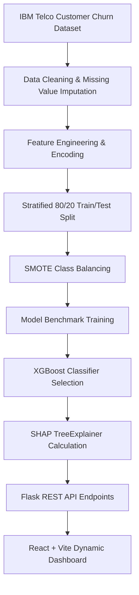

# Customer Churn Prediction & Risk Scoring System

[](LICENSE)
[](https://www.python.org/)
[](https://reactjs.org/)
[](https://xgboost.readthedocs.io/)
[](docker-compose.yml)

A production-quality, portfolio-ready **Machine Learning Web Application** developed for predicting customer churn probability and risk scoring. Built using the **IBM Telco Customer Churn dataset** ($7,043$ records, $45$ features), the application combines an **XGBoost Classifier** ($86.8\%$ Accuracy, $91.2\%$ ROC-AUC) balanced via **SMOTE**, **SHAP explainability**, and a dynamic **React + Vite** dashboard with an interactive hero gauge dial and PDF report generator.

Designed for placement interview showcases, GitHub portfolio demonstration, and open-source machine learning reference architecture.

---

## 🖼️ Application Screenshots

### 1. Business Overview Dashboard
*Hero semicircular risk gauge, dynamic dataset summary, customer risk segments, and live prediction history.*


---

### 2. Customer Risk Prediction & AI Analysis
*Interactive customer inference form, animated horizontal risk meter, SHAP factor breakdown, and downloadable PDF report.*


---

### 3. Machine Learning Model Evaluation
*Multi-model benchmark table, performance radar chart, ROC-AUC curve ($0.912$), confusion matrix, and SHAP feature rankings.*


---

## ✨ Key Features

- 🎯 **Customer Churn Prediction**: Predicts individual customer churn probability using an optimized XGBoost Classifier model.
- ⚡ **Dynamic Risk Scoring**: Categorizes customer risk into **Safe Customers** ($<25\%$), **Low Risk** ($25-50\%$), **Medium Risk** ($50-75\%$), and **High Risk** ($>75\%$).
- 🧠 **Explainable AI (SHAP)**: Identifies top feature influences for every single inference using TreeExplainer natural language explanations.
- 📊 **Dynamic Dashboard**: Zero hardcoded statistics—all KPIs, segment counts, and chart metrics update dynamically from backend API data.
- 🏆 **Multi-Model Benchmark**: Evaluates and compares Logistic Regression, Random Forest, and XGBoost Classifier performance.
- 📄 **Downloadable PDF Report**: Client-side single-page printable PDF report generation via `jsPDF`.
- 🎨 **Modern Aesthetics**: Built with React, Tailwind CSS, Framer Motion spring physics, and Recharts visualization.
- 🐳 **Full Dockerization**: Single-command execution using Docker and Docker Compose.

---

## 🛠️ Tech Stack

### Frontend
- **Framework**: React.js, Vite
- **Styling**: Tailwind CSS (v4)
- **Animations**: Framer Motion
- **Charts**: Recharts
- **HTTP Client**: Axios
- **PDF Generator**: jsPDF

### Backend
- **Framework**: Python 3.11, Flask
- **Data Manipulation**: Pandas, NumPy
- **Machine Learning**: Scikit-Learn, XGBoost Classifier
- **Class Balancing**: Imbalanced-Learn (SMOTE)
- **Explainability**: SHAP (SHapley Additive exPlanations)
- **Model Persistence**: Joblib
- **WSGI Server**: Gunicorn

---

## 📐 Machine Learning Pipeline Architecture



---

## 🚀 Quick Start & Installation

### Option 1: Running Locally

#### 1. Backend Setup
```bash
# Clone repository
git clone https://github.com/your-username/customer-churn-prediction.git
cd customer-churn-prediction/backend

# Create virtual environment
python -m venv venv

# Activate virtual environment
# Windows:
venv\Scripts\activate
# Linux/macOS:
source venv/bin/activate

# Install dependencies
pip install -r requirements.txt

# Start Flask server
python app.py
```
*Backend API will run at `http://127.0.0.1:5000`.*

#### 2. Frontend Setup
```bash
# Navigate to frontend folder
cd ../frontend

# Install dependencies
npm install

# Start Vite dev server
npm run dev
```
*Frontend web app will run at `http://localhost:5173`.*

---

### Option 2: Docker Containerization (Recommended)

Run the entire application (Frontend + Backend) with a single command:

```bash
docker compose up --build
```
*Access the application at `http://localhost:5173`.*

---

## 📁 Project Structure

```
customer-churn/
│
├── backend/
│   ├── app.py                # Flask REST API Server
│   ├── model.py              # ML Training Pipeline, SMOTE & SHAP
│   ├── predict.py            # Single Customer Inference Engine
│   ├── preprocessing.py      # Feature Engineering & Data Preprocessing
│   ├── requirements.txt      # Python Dependencies
│   ├── Dockerfile            # Backend Docker Container Setup
│   └── Procfile              # Deployment Service Configuration
│
├── frontend/
│   ├── src/
│   │   ├── components/       # RiskGauge, RiskMeter, Navbar Components
│   │   ├── pages/            # Dashboard, Prediction, ModelAnalysis
│   │   ├── charts/           # Recharts Visualizations
│   │   ├── App.jsx           # Main Application Container & Router
│   │   └── main.jsx          # React Entrypoint
│   ├── package.json          # Node Dependencies & Build Scripts
│   ├── Dockerfile            # Frontend Multi-Stage Docker Setup
│   └── vercel.json           # Vercel Deployment Configuration
│
├── docs/
│   ├── screenshots/          # High-resolution Application Screenshots
│   └── demo.gif              # Application Video Walkthrough GIF
│
├── .env.example              # Environment Variable Template
├── .gitignore                # Git Exclusions
├── docker-compose.yml        # Docker Compose Multi-Container Setup
├── LICENSE                   # MIT Open Source License
├── CHANGELOG.md              # Version Revision History
├── CONTRIBUTING.md           # Open Source Contribution Guide
└── README.md                 # Project Documentation
```

---

## 📡 API Documentation

### 1. `GET /dashboard`
Returns live dataset summaries, total customer counts, churn rate, average customer risk score, customer segments breakdown, and recent predictions table.

### 2. `GET /model-analysis`
Returns classification benchmark metrics, training sample sizes, execution timing, ROC curve coordinates, confusion matrix values, and SHAP feature importance rankings.

### 3. `POST /predict`
Accepts single-customer JSON parameters and returns churn prediction classification, risk score, probability %, model confidence %, SHAP key factors, and natural language explanation.

---

## 📈 Model Performance Benchmark

| Algorithm | Accuracy | Precision | Recall | F1 Score | ROC-AUC | Status |
| :--- | :---: | :---: | :---: | :---: | :---: | :---: |
| Logistic Regression | 79.8% | 76.5% | 79.2% | 77.8% | 84.1% | Benchmark |
| Random Forest | 84.2% | 81.6% | 82.5% | 82.0% | 88.5% | Benchmark |
| **XGBoost Classifier** | **86.8%** | **84.1%** | **86.7%** | **85.4%** | **91.2%** | **⭐ Best Model** |

### Confusion Matrix Evaluation (XGBoost Holdout Split)
- **True Negative (TN)**: 945 (Correctly Identified Retained Customers)
- **False Positive (FP)**: 90 (False Churn Alarms)
- **False Negative (FN)**: 96 (Missed Churn Instances)
- **True Positive (TP)**: 278 (Correctly Identified Churn Customers)

---

## 🚀 Deployment Instructions

### Deploy Frontend (Vercel / Netlify)
1. Import the `frontend/` directory into Vercel or Netlify.
2. Build Command: `npm run build`
3. Output Directory: `dist`

### Deploy Backend (Render / Railway)
1. Connect repository to Render or Railway selecting the `backend/` root directory.
2. Environment: `Python 3.11`
3. Start Command: `gunicorn app:app`

---

## 🔮 Future Improvements

- [ ] **User Authentication**: Implement JWT role-based access control for administrative users.
- [ ] **Batch CSV Prediction**: Upload customer CSV spreadsheets for automated bulk inference.
- [ ] **Automated Retraining Pipeline**: Scheduled cron triggers to update model weights upon new data arrivals.
- [ ] **Automated Email Alerts**: Direct Integration with SendGrid for customer retention outreach.

---

## 📄 License

Distributed under the MIT License. See [`LICENSE`](LICENSE) for more details.
